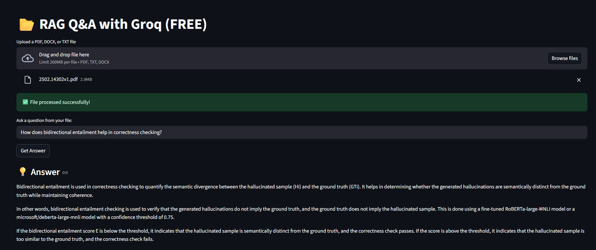

# 🚀 DocuGenie — Intelligent PDF Chat Assistant (Enterprise-Ready RAG System)

<div align="center">




**Chat with your PDFs using Retrieval-Augmented Generation (RAG)**  
Transform static documents into intelligent, searchable knowledge systems.

</div>

---

# 📖 Overview

DocuGenie is an AI-powered Retrieval-Augmented Generation (RAG) system that enables users to interact conversationally with PDF documents.

Instead of manually searching through lengthy reports, research papers, contracts, or policy documents, users can simply ask natural language questions and receive accurate, context-aware answers.

This project demonstrates how modern LLM systems can be combined with vector search to solve real-world document intelligence problems.

---

# 🌍 Real-World Problem This Solves

## ❌ Problem 1: Large Documents Are Hard to Navigate

Organizations deal with:

- 200+ page policy manuals
- Legal contracts
- Research papers
- Financial reports
- Compliance documentation
- Academic textbooks

Manually searching through them is:

- Time-consuming  
- Error-prone  
- Inefficient  

---

## ❌ Problem 2: Generic LLMs Cannot Access Private Data

If you ask ChatGPT:

> "What does our company HR policy say about maternity leave?"

It cannot answer because:

- The model was not trained on your private documents.
- Organization-specific data is not public.
- Sending raw data without retrieval leads to hallucinations.

---

## ❌ Problem 3: LLM Hallucination Risk

Standard LLMs often:

- Generate confident but incorrect answers
- Fabricate policy clauses
- Create fake references
- Invent legal interpretations

This is dangerous for:

- Legal teams
- Healthcare institutions
- Financial organizations
- Government departments

---

# ✅ How DocuGenie Solves This

DocuGenie implements a **Retrieval-Augmented Generation (RAG)** architecture:

1. 📄 Upload PDF
2. ✂️ Split text into chunks
3. 🧠 Generate embeddings
4. 📦 Store in vector database
5. 🔎 Retrieve relevant chunks for each question
6. 🤖 Pass only relevant context to LLM
7. 💬 Generate grounded, context-aware answer

This reduces hallucination and improves factual accuracy.

---

# 🏢 Organization-Level Use Cases

DocuGenie can be deployed internally in:

### 🏥 Healthcare
- Query clinical guidelines
- Search treatment protocols
- Review medical research documents

### ⚖️ Legal Firms
- Analyze contracts
- Extract clause summaries
- Validate compliance documentation

### 🏦 Banking & Finance
- Search regulatory documents
- Extract policy updates
- Analyze audit reports

### 🎓 Universities
- Query research papers
- Summarize academic documents
- Assist students in understanding textbooks

### 🏢 Corporate HR & Compliance
- Query internal HR policies
- Retrieve onboarding procedures
- Answer compliance-related questions

---

# ⚠️ What This Project Does NOT Solve

DocuGenie is powerful, but:

❌ It cannot correct incorrect content inside the document  
❌ It cannot verify truth outside the uploaded PDF  
❌ It does not replace legal/medical experts  
❌ It depends on document quality  

If the document contains errors, the system will reflect those errors.

---

# 🧠 Why Not Use Only an LLM?

Using only an LLM:

- Cannot access private data
- Hallucinates when unsure
- Cannot cite exact source sections
- Lacks document grounding

DocuGenie solves this by:

✔ Grounding responses in document context  
✔ Retrieving only relevant chunks  
✔ Reducing hallucination probability  
✔ Improving answer traceability  

---

# ✨ Key Features

- 📄 Multi-PDF Upload
- 💬 Context-Aware Q&A
- 🧠 Conversational Memory
- ⚡ Fast Semantic Search
- 📎 Source Transparency
- 📥 Chat History Download
- 🔒 Works with Private Data
- 🚀 Streamlit-based UI

---

# 🛠️ Tech Stack

## Application Framework
- Streamlit

## AI & NLP
- Python
- LangChain
- OpenAI / Groq / Grok API (Configurable)
- Sentence Transformers

## Vector Database
- FAISS / ChromaDB

## PDF Processing
- PyPDF
- Unstructured

## Environment Management
- python-dotenv

---

# 🏗️ System Architecture

User Query  
↓  
Semantic Retrieval (Vector Search)  
↓  
Context Injection  
↓  
LLM Response Generation  
↓  
Grounded Answer  

This architecture significantly improves reliability compared to standalone LLM usage.

---

# 🚀 Installation Guide

## 1️⃣ Clone Repository

```bash
git clone https://github.com/Rishikesh1411/DocuGenie-Intelligent-PDF-Chat-Assistant.git
cd DocuGenie-Intelligent-PDF-Chat-Assistant
```

## 2️⃣ Create Virtual Environment

```bash
python -m venv venv
venv\Scripts\activate   # Windows
```

## 3️⃣ Install Dependencies

```bash
pip install -r requirements.txt
```

## 4️⃣ Setup Environment Variables

Create `.env`:

```
GROK_API_KEY=your_api_key_here
```

## 5️⃣ Run Application

```bash
streamlit run app.py
```

---

# 📁 Project Structure

```
DocuGenie/
├── app.py
├── requirements.txt
├── .env.example
├── LICENSE
├── demo.png
└── README.md
```

---

# 📊 Resume-Ready Project Description

**DocuGenie — Intelligent PDF Chat Assistant (RAG-based System)**  
Developed a retrieval-augmented AI system enabling contextual Q&A over private PDF documents. Integrated semantic search with large language models to reduce hallucinations and improve factual grounding. Designed for enterprise document intelligence use cases including legal, healthcare, and corporate compliance domains.

---

# 🔮 Future Improvements

- Multi-user authentication
- Persistent vector database
- Cloud deployment (AWS / Azure / GCP)
- Role-based document access
- Streaming LLM responses
- Citations highlighting exact document sections

---

# 📜 License

MIT License

---

# 🙌 Acknowledgments

- Streamlit
- LangChain
- OpenAI / Groq / Grok
- FAISS
- Sentence Transformers

---

<div align="center">

⭐ If you found this project useful, consider starring the repository!

Built with ❤️ by Rishikesh Raj

</div>
